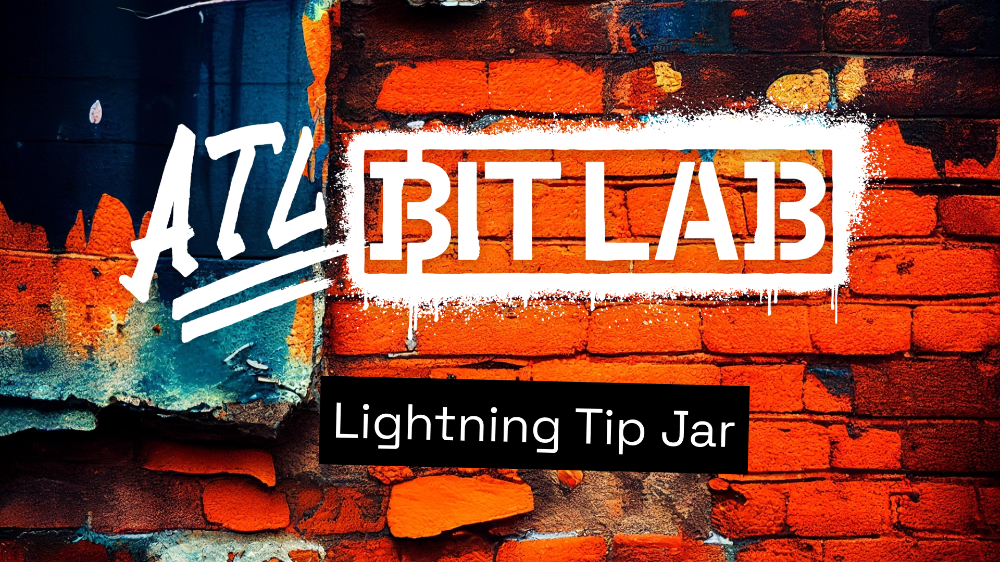

# Lightning Tip Jar

A small Next.js web app that accepts Bitcoin Lightning tips. Pick (or type) a sat amount, leave an optional message, and pay the generated invoice from any Lightning wallet. The page polls invoice status and celebrates with confetti on payment.

Built by [ATL BitLab](https://atlbitlab.com).



## Tech Stack

- Next.js 15 (App Router, Turbopack dev)
- React 19
- TypeScript 5
- TailwindCSS 4
- Lightning via [`@getalby/sdk`](https://www.npmjs.com/package/@getalby/sdk) over Nostr Wallet Connect (NWC)
- `qrcode.react`, `react-confetti`, `axios`

## How It Works

- **`POST /api/invoice`** — server creates a Lightning invoice via NWC `makeInvoice` and returns `{ paymentRequest, paymentHash }`.
- **`GET /api/invoice?paymentHash=...`** — server calls NWC `lookupInvoice`; client polls every 3s until `settled_at` is set.
- The `ws` package is shimmed onto `globalThis.WebSocket` so the NWC client can connect from a Next.js Route Handler.

## Setup

1. Clone:
   ```
   git clone https://github.com/ATLBitLab/lntipjar.git
   cd lntipjar
   ```
2. Install:
   ```
   yarn install
   ```
3. Create `.env.local` with a Nostr Wallet Connect URL from your wallet (Alby, Mutiny, Coinos, etc.):
   ```
   NOSTR_WALLET_CONNECT_URL=nostr+walletconnect://<your-connect-url>
   ```
   See `.env.example`.
4. Run:
   ```
   yarn dev
   ```
5. Open <http://localhost:3000>.

## Scripts

| Command       | What it does                       |
|---------------|------------------------------------|
| `yarn dev`    | Dev server (Turbopack) on :3000    |
| `yarn build`  | Production build                   |
| `yarn start`  | Start production server            |
| `yarn lint`   | ESLint (`next/core-web-vitals`)    |

## Project Layout

```
app/
  api/invoice/route.ts   # POST creates invoice, GET checks status
  components/
    TipJar.tsx           # Main UI (client)
    TipJarWrapper.tsx    # Dynamic import wrapper, ssr: false
    Button.tsx           # Shared button
  layout.tsx             # Root layout, metadata, OG tags
  page.tsx               # Home
  globals.css
public/                  # Images, favicon
```

## Configuration

`NOSTR_WALLET_CONNECT_URL` (required) — NWC URI of the wallet that will issue and look up invoices.

## License

[MIT License](LICENSE)

---

Built by [ATL BitLab](https://atlbitlab.com).
